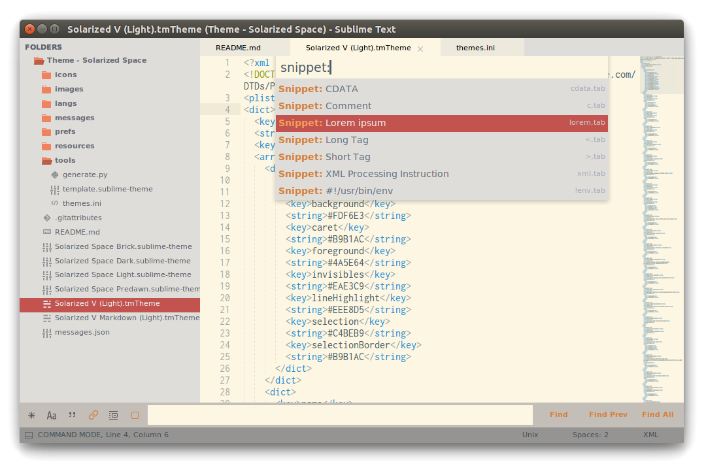

Theme - Solarized Space
=======================

Light and dark solarized themes for Sublime Text.

Based on [Spacegray](https://kkga.github.io/spacegray/),
[Sodarized](https://github.com/jrolfs/sodarized),
[Predawn](http://jamiewilson.io/predawn/) and
[Piatto](https://github.com/samuelrafo/piatto) among other.

Tweaks and ideas are welcome :)

Note: To show or hide sidebar icons use setting `"hide_sidebar_icons"`.

Themes
------

### Solarized Space Light

```json
"theme": "Solarized Space Light.sublime-theme",
```


### Solarized Space Brick

```json
"theme": "Solarized Space Brick.sublime-theme",
```



### Solarized Space Dark

```json
"theme": "Solarized Space Dark.sublime-theme",
```


### Solarized Space Predawn

```json
"theme": "Solarized Space Predawn.sublime-theme",
```


### Related Options

Try adding combinations of the following to your
`User/Preferences.sublime-settings`

```json
"hide_sidebar_icons": true,
"always_show_minimap_viewport": true,
"bold_folder_labels": true,
"enable_tab_scrolling": false,
"overlay_scroll_bars": "enabled",
```

Color Schemes
-------------

Solarized light with lighter cursor

```json
"color_scheme": "Packages/Theme - Solarized Space/Solarized V (Light).tmTheme",
```

Solarized light for [MarkdownEditing](https://github.com/SublimeText-Markdown/MarkdownEditing)

```json
"color_scheme": "Packages/Theme - Solarized Space/Solarized V Markdown (Light).tmTheme",
```
